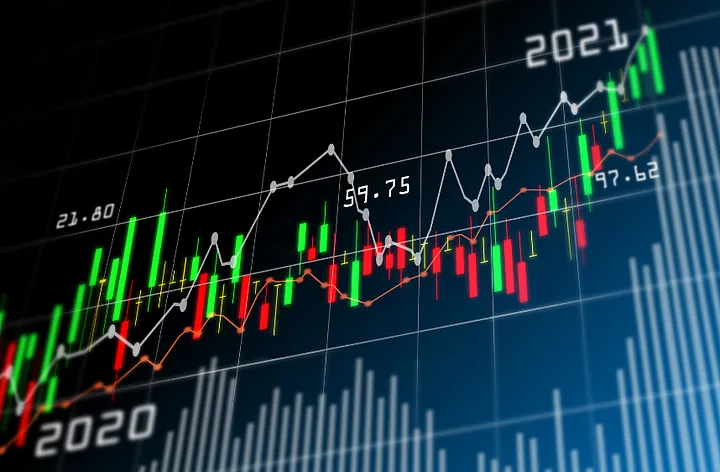

# 📊 Bitcoin Market Analytics & Forecasting Dashboard



## 📌 Project Overview
This project is an end-to-end **Bitcoin market analytics and forecasting application** developed as part of a **Data Analytics Mock Internship at Mesa Community College**. It demonstrates the complete data analytics lifecycle — from data ingestion and cleaning to visualization and basic predictive modeling — using Python and an interactive dashboard.

The core objective is to analyze historical Bitcoin market data (OHLCV), communicate insights through clear visualizations for non-technical stakeholders, and provide simple baseline forecasting models for short-term price trends.


---

## ▶️ How to Run the Project

Follow the steps below to run the project locally and launch the interactive dashboard.

    Clone the Repository: 
      - git clone https://github.com/Mun-Min/Bitcoin_Forecasting.git
      - cd <your-project-folder>

    Install core libraries: 
      - pip install pandas numpy scikit-learn matplotlib seaborn plotly streamlit

    Run the dashboard: 
      - streamlit run dashboard_app.py

---

## 🎯 Key Features
- Automated **data pipeline** for loading, cleaning, and resampling Bitcoin market data
- Cleaned **hourly and daily OHLCV datasets**
- Exploratory Data Analysis (EDA) using Jupyter Notebooks
- Interactive **Streamlit dashboard** with:
  - Candlestick price charts
  - BTC trading volume and estimated USD volume
  - Forecasting using Naive and Simple Moving Average (SMA) models
- [Kaggle Dataset | Bitcoin Historical Data](https://www.kaggle.com/datasets/mczielinski/bitcoin-historical-data)

---

## 🧠 Forecasting Approach
This project intentionally uses **simple baseline models**:
- **Naive Forecast** – assumes future prices follow the most recent observed value
- **Simple Moving Average (SMA)** – smooths price noise and captures short-term trends

These models are transparent, interpretable, and suitable for educational analysis of financial time series without overfitting.

[Click to read more about the models](https://medium.com/@rais.sulaiman/part-2-types-of-time-series-for-forecasting-naive-simple-average-and-moving-average-e431cd0f403e)

---

## 🗂️ Project Structure
```plaintext
├── Datasets/
│   ├── clean_btcusd_daily.csv
│   └── clean_btcusd_hourly.csv
│
├── BTC_Data_Pipeline.py
├── dashboard_app.py
├── Data_Cleaning_Notebook.ipynb
├── EDA_Notebook.ipynb
└── README.md
